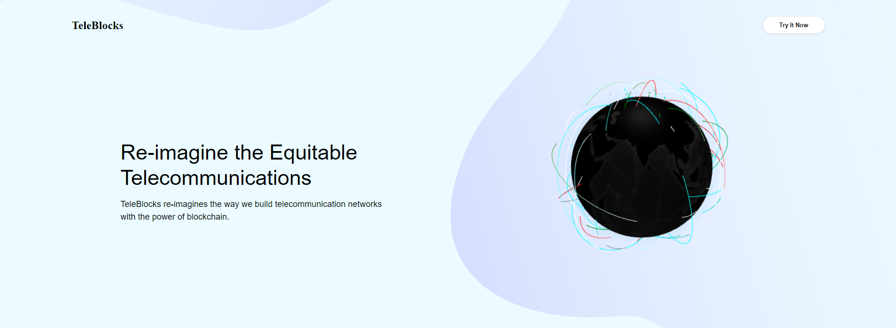
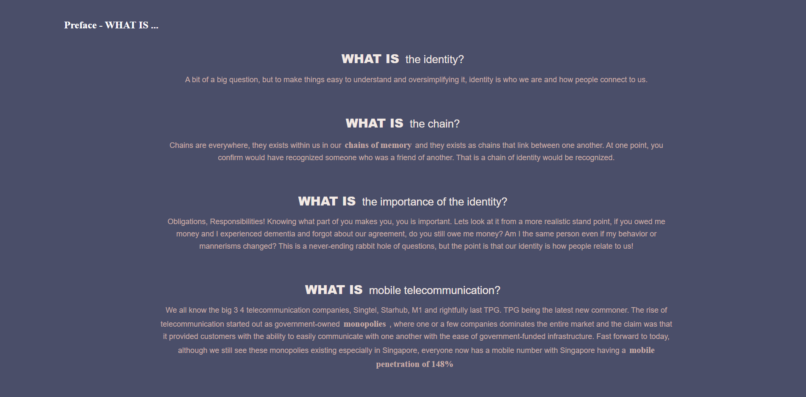
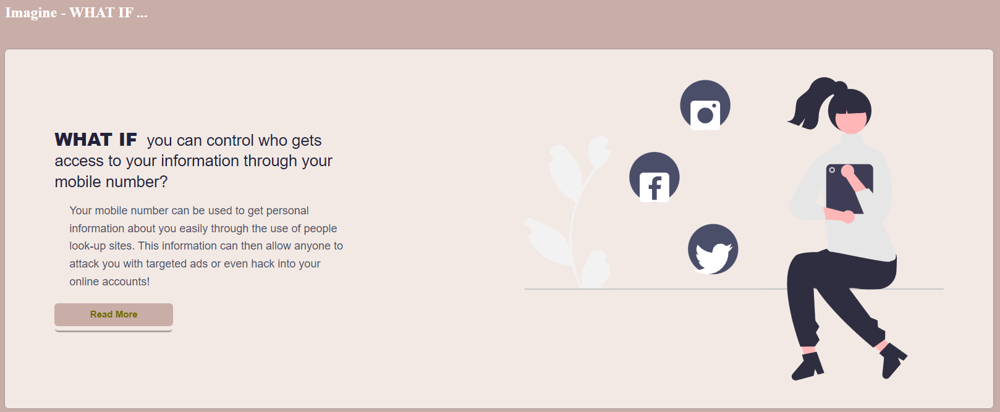
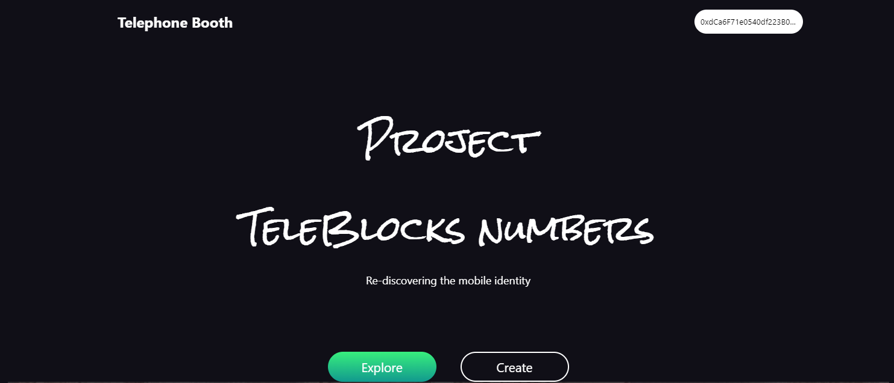
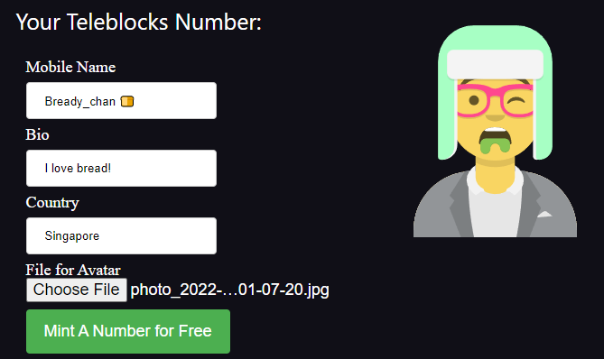

# Open Place TeleBlocks

## Website 

[Start your journey](https://cawinchan.github.io/TeleBlocks/)

## 🎯 Goal

Our aim is to allow people to take back ownership of their mobile identities. 

## 📚 Context
Oligopolistic telecommunication companies hold significant power on your mobile identity, the mobile has been an increasingly integral part of our life even becoming part of our identity. They act as an extension of our own identity, acting as our digital identity it offers a means of extending access to a wide range of services, such as mobile banking and mobile health, and even opportunities such as networking and jobs. Opportunities that would be especially important to those who have been particularly marginalized, such as women and those living in poverty. Quintessentially, the mobile identity boils down to the role of communication and interaction between new acquaintances and fostering bonds. But what can an individual do if telecommunication companies decided to pull the plug on your mobile identity? In an instant, your mobile identity ceases to exist and those who know you are unable to reach you. 

## 💪 Objective

As such, our group's mission is to drive the separation of power of the mobile identity to the masses. This is done through the use of a free, open, personalizable TeleBlock Number NFT that belongs to each user. Everything is customizable extending past the number rhetoric, it allows for letters, symbols, and even emojis. There is also another texture element to the TeleBlock number NFT where the NFT can include a pictorial and even 3d graphical renders that allow for the user to escape the dimensions that restrict their idea of how they want their identity to be seen.
  
## 🔮 Usage
In the project directory, you can run:

### `npm install (for first running)`
### `npm start`

## 🖥️ Screenshots 
 
## Web 2
Web 2.0 refers to a paradigm shift in the utilization of the internet. Web 2.0 allows user-generated material to be viewed by millions of people all over the world in an instant; this unprecedented reach has resulted in an explosion of this form of content in recent years.
 
### Home

 
 ### Preface

 
 ### WHAT IF

## Web 3
Web 3.0 is the next iteration or phase in the evolution of the web/internet, and it has the potential to be as disruptive.  Web 3.0 is based on the fundamental ideals of decentralization, openness, and increased consumer usefulness.
 
### Home

### Explore

 
### Create Your Own Number

### Number Detail

### Augmented Reality Support

 
Credits to: [Reactjs And Smart Contracts Open Source Basic Nft Marketplace App](https://github.com/yessGlory17/nft-marketplace)

## Contributors ✨

Thanks goes to these wonderful people ([emoji key](https://allcontributors.org/docs/en/emoji-key)):

<!-- ALL-CONTRIBUTORS-LIST:START - Do not remove or modify this section -->
<!-- prettier-ignore-start -->
<!-- markdownlint-disable -->
<table>
  <tr>
   <td align="center"><a href="https://github.com/ohyamn"> <b>Yai Yan Lin</b></a> <a href="#content-ohyamn" title="Content">🍠</a></td>
   <td align="center"><a href="https://github.com/MarkHershey"> <b>Mark Huang</b></a> <a href="#content-MarkHershey" title="Web2">🐈</a></td>
   <td align="center"><a href="https://github.com/Cawinchan"> <b>Cawin Chan</b></a> <a href="#content-Cawinchan" title="Web3">🍞</a></td>
    <td align="center"><a href="https://github.com/GehadSalemFekry"> <b>Gehad Salem Fekry</b></a> <a href="#content-GehadSalemFekry" title="Content">🖋</a></td>
    <td align="center"><a href="https://github.com/digambar-t7"> <b>Digambar Tupurwadi</b></a> <a href="https://github.com/yessGlory17/nft-marketplace/issues?q=author%3Adigambar-t7" title="Bug reports">🐛</a></td>
    <td align="center"><a href="https://github.com/burakkaraceylan"> <b>burakkaraceylan</b></a> <a href="https://github.com/yessGlory17/nft-marketplace/commits?author=burakkaraceylan" title="Code">💻</a></td>
    <td align="center"><a href="https://bandism.net/"> <b>Ikko Ashimine</b></a> <a href="#content-eltociear" title="Content">🖋</a></td>
  </tr>
</table>

<!-- markdownlint-restore -->
<!-- prettier-ignore-end -->

<!-- ALL-CONTRIBUTORS-LIST:END -->

This project follows the [all-contributors](https://github.com/all-contributors/all-contributors) specification. Contributions of any kind welcome!
